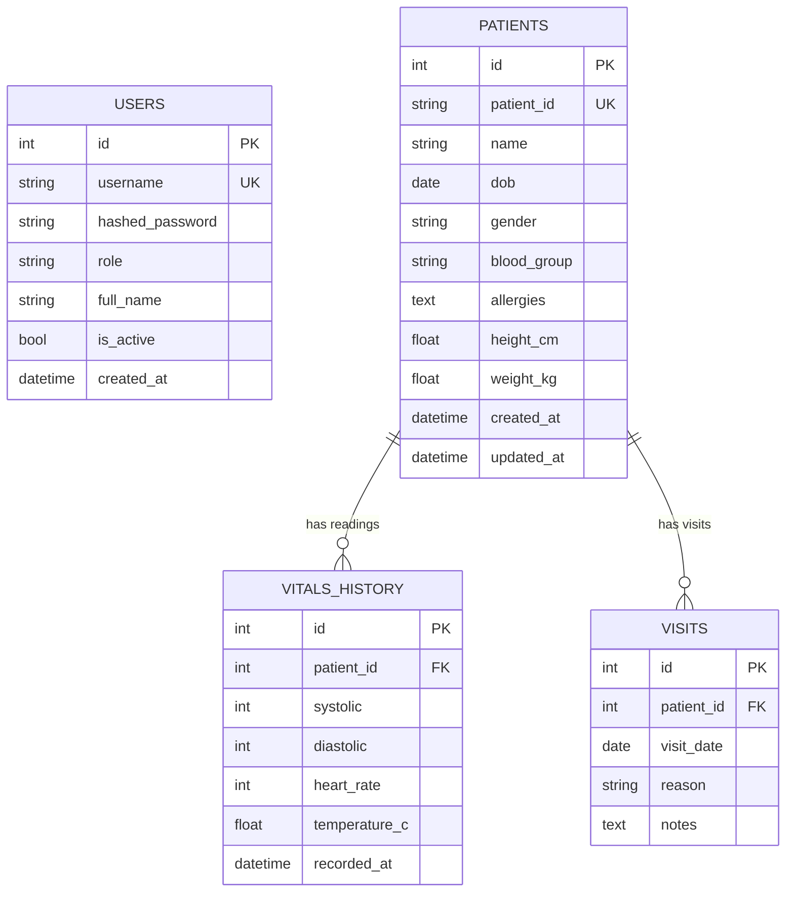

# Entity–Relationship Model — MediTrack v2

## Notes
- **1 : N** — one patient owns many vitals readings and many visits.
- **Cascade delete** — removing a patient removes their readings and visits
  (`cascade="all, delete-orphan"`).
- **Allergies** are stored as a comma-separated string on the patient row
  (set semantics preserved via parse/serialize helpers).
- **Users** are independent of patients in v2 (staff accounts only);
  a patient-facing role is a listed extension.

## Mapping to v1
- v1 `data.PATIENTS` (list of dicts) → `PATIENTS` + `VITALS_HISTORY` + `VISITS`.
- v1 `data.HOSPITAL` tree → not normalised; used at read-time by the recursive
  department report (`analytics.count_departments` / `list_departments`).
- v1 `data/patients.txt` + `patient_visits.txt` → replaced by the SQLite
  database (`data/meditrack.db`).